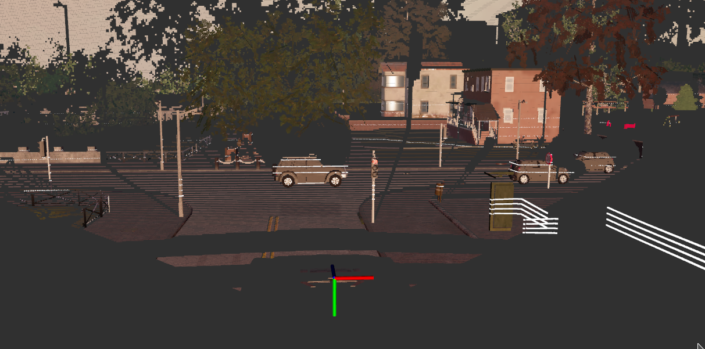

# ROS bridge for CARLA simulator

This ROS package aims at providing a simple ROS bridge for CARLA simulator.

__Important Note:__
This documentation is for CARLA versions *newer* than 0.9.1. The CARLA release 0.9.1
does not work out of the box with the ROS bridge.

# Features

- [x] Cameras (depth, segmentation, rgb) support
- [x] Transform publications
- [x] Manual control using ackermann msg
- [x] Handle ROS dependencies
- [x] Marker/bounding box messages for cars/pedestrian
- [x] Lidar sensor support
- [ ] Rosbag in the bridge (in order to avoid rosbag record -a small time errors)
- [ ] Add traffic light support

## Install the CARLA Python API

    sudo easy_install <path/to/carla/>/PythonAPI/<your_egg_file>

Just as an example, for me, the command is this:
	
    sudo easy_install '/home/neil/carla/PythonAPI/carla-0.9.2-py2.7-linux-x86_64.egg'
    
Please note that you have to put in the complete path to the egg-file including
the egg-file itself. Please use the one, that is supported by your Python version.
Depending on the type of CARLA (pre-build, or build from source), the egg files
are typically located either directly in the PythonAPI folder or in PythonAPI/dist.

Check the installation is successfull by trying to import carla from python:

    python -c 'import carla;print("Success")'

You should see the Success message without any errors.

## Install other requirements:

    sudo apt-get install python-protobuf
    pip install --user simple-pid

# Start the ROS bridge

First run the simulator. For the full and latest documentary, please always refer to the carla official website. (see carla documentation: http://carla.readthedocs.io/en/latest/)

     ./CarlaUE4.sh -ResX=320 -ResY=240

Wait for the message:

    Waiting for the client to connect...

Then start the ros bridge:

	roslaunch simulation carla_client.launch

To start the ros bridge with rviz use:

    roslaunch carla_ros_bridge carla_client_with_rviz.launch

You can setup the vehicle configuration config/settings.yaml.

Then you can __make use of the CARLA Python API script__ `manual_control.py`.
This spawns a vehicle with role_name='hero' which is interpreted as the ego
vehicle as defined by the config/settings.yaml.

You can then further spawn other vehicles using `spawn_npc.py` from CARLA Python API.
Then those vehicles will show up also on ROS side.

# Test control messages
You can send command to the car using the /carla/ego_vehicle/ackermann_cmd topic.

Example of forward movements, speed in in meters/sec.

     rostopic pub /carla/ego_vehicle/ackermann_cmd ackermann_msgs/AckermannDrive "{steering_angle: 0.0, steering_angle_velocity: 0.0, speed: 10, acceleration: 0.0,
      jerk: 0.0}" -r 10

Example of forward with steering

     rostopic pub /carla/ego_vehicle/ackermann_cmd ackermann_msgs/AckermannDrive "{steering_angle: 5.41, steering_angle_velocity: 0.0, speed: 10, acceleration: 0.0,
      jerk: 0.0}" -r 10

  Warning: the steering_angle is the driving angle (in radians) not the wheel angle, for now max wheel is set to 500 degrees.

# ROS Information

This section provides some brief information on the ROS topics of ROS-Carla brige. Most of the important topics are listed below, along with the message types.

## Object information

### Ego vehicle

The ego vehicle status is provided via the topic `/carla/ego_vehicle/odometry` (nav_msgs.Odometry)

### Other vehicles

The other vehicles data is provided via the 'ideal' object list `/carla/objects` (derived_object_msgs.ObjectArray)

## Map information

The OPEN Drive map description is published via `/map` topic (std_msgs.String)

## Sensor information

### Ego vehicle
The ego Vehicle sensors are provided via topics with prefix `/carla/ego_vehicle/<sensor_topic>`

# ROSBAG recording
__(not yet tested)__

The carla_ros_bridge could also be used to record all published topics into a rosbag:

    roslaunch carla_ros_bridge client_with_rviz.launch rosbag_fname:=/tmp/save_session.bag

This command will create a rosbag /tmp/save_session.bag

You can of course also use rosbag record to do the same, but using the ros_bridge to do the recording you have the guarentee that all the message are saved without small desynchronization that could occurs when using *rosbag record* in an other process.

# Contact & Information

This project was originally developed by @laurent-george, and modified by @NeilNie for the self-driving golf cart project. Please contact Neil at contact@neilnie.com if you have any questions, comments or concerns.

